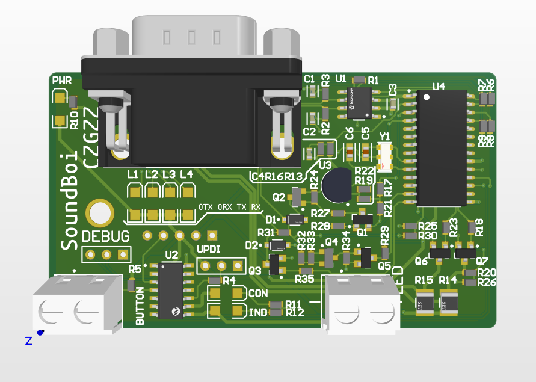

# SoundBoi
SoundBoi is the codename for a porject which is intended to use with the [BLAT!](https://github.com/hamgzz/BLAT) module for the holden commodored OEM bimodel exhaust. However, it can be extended for use with other cars and valved mufflers. This project originally started when I still had my Holden Barina and wanted an automatic exhaust valve. Over time from trying to write my own CAN transceiver using the teensy line of transceivers and using dodgy rip-off ELM327s with ESP32s, I finally bit the bullet and invested in a few actual ELM327 chips... This is where SoundBoi comes in. SoundBoi is a complete custom solution using the ELM327 chip and an atTiny1614 to communicate with BLAT!. BLAT! is the module the creates the specific PWM and voltages needed to control the OEM Holden mufflers... And yes, all this could be built into one board, but BLAT! came before SoundBoi...

The board follow's a specific set of rules which can be found in the source code.

## Rules
The SoundBoi uses 4 states and a set of rules it follows to determine if the valves should be oppened or closed.
The valve will be open for the first 5 seconds since the car's startup.

### Rules 1 (Default state)
The valve will open if:
 - Speed < 90 AND:
 	- RPM       > 3000
 	- Load      > 50%
 	- Throttle  > 50%
 - Speed > 90 AND:
	- RPM       > 4000
	- Load      > 70%
	- Throttle  > 80%
 - Speed < 5 AND engine is up to temperature.

### Rules 2
The valve will open if:
 - Speed < 90 AND:
	- RPM       > 1900
	- Load      > 30%
	- Throttle  > 30%
 - Speed > 90:
	- Revert back to Rules set 1.
 - Speed < 15 AND engine is up to temperature.

### Rules 3
The valve is always open.

### Rules 4
The valve is always closed.

## PCB

The PCB is meant to be attached to the BLAT! module back-to-back. This is to keep the boards small and modular. The SoundBoi PCB takes it's 5V from the Pololu [regulator](https://www.pololu.com/product/2843) and reads the battery voltage from the 12v coming from the relay on the BLAT! module. Because of the ignition relay, there is no need for low power cutoff on the SoundBoi module, but it might come in future revisions....

### Schematic

<object data="PCB/SoundBoi/SoundBoi.pdf" type="application/pdf" width="700px" height="700px">
    <embed src="PCB/SoundBoi/SoundBoi.pdf">
        
This browser does not support PDFs. Please download the PDF to view it: <a href="PCB/SoundBoi/SoundBoi.pdf">Download PDF</a>.

    </embed>
</object>

### 3D Models

### BOM

|Description                                                                                  |Designator                             |Value  |Manufacturer Part Number 1|Footprint             |Quantity|
|---------------------------------------------------------------------------------------------|---------------------------------------|-------|--------------------------|----------------------|--------|
|Female Header, Pitch 5 mm, 1 x 2 Position, Height 10 mm, Tail Length 3.5 mm, Rohs, Bulk      |BUTTON, LED                            |       |282836-2                  |TECO-282836-2_V       |2       |
|CAP CER 560PF 50V X7R 0603                                                                   |C1, C2                                 |560 pF |C0603C561K5RACTU          |FP-C0603C-CF-MFG      |2       |
|CAP CER 0.1UF 50V X7R 0603                                                                   |C3, C4                                 |0.10 uF|C0603C104K5RACTU          |FP-C0603C-CF-MFG      |2       |
|Multilayer Ceramic Capacitors 27pF  5% 50V NP0 SMD 0603                                      |C5, C6                                 |       |C1608NP01H270J080AA       |FP-C1608-080-0_1-IPC_A|2       |
|Typical RED, GREEN, YELLOW, AMBER GaAs LED                                                   |CON, IND, L1, L2, L3, L4, PWR          |       |                          |3.2X1.6X1.1           |7       |
|DIODE GEN PURP 100V 150MA SOD123                                                             |D1, D2                                 |2pF    |1N4148W-13-F              |FP-SOD123-MFG         |2       |
|Header, 3-Pin                                                                                |DEBUG, UPDI                            |       |                          |HDR1X3                |2       |
|Male PCB Connector with Hex Screw WR-DSUB, 10.30 mm, Angled, 9 pins                          |J1                                     |       |618009231421              |618009231421          |1       |
|Header, 5-Pin                                                                                |P2                                     |       |                          |HDR1X5                |1       |
|NPN General Purpose Amplifier, 40 V, 0.2 A, -55 to 150 degC, 3-Pin SOT23, RoHS, Tape and Reel|Q1, Q3, Q5, Q6, Q7                     |       |MMBT3904                  |FAIR-SOT23-3_V        |5       |
|General Purpose Transistor, PNP Silicon, 3-Pin SOT-23, Pb-Free, Tape and Reel                |Q2, Q4                                 |       |MMBT3906LT1G              |ONSC-SOT-23-3-318-08_V|2       |
|Resistor                                                                                     |R1, R4, R27, R28, R29, R35             |4.7K   |                          |J1-0603               |6       |
|Resistor                                                                                     |R2, R3                                 |100    |                          |J1-0603               |2       |
|Resistor                                                                                     |R5, R16, R24, R30, R32, R34            |10K    |                          |J1-0603               |6       |
|Resistor                                                                                     |R6, R7, R8, R9, R10, R11, R12, R19, R22|470    |                          |J1-0603               |9       |
|Resistor                                                                                     |R13, R20, R33                          |47K    |                          |J1-0603               |3       |
|510O  5% 0.5W 1210 Thick Film Chip Resistor AEC-Q200 compliant                               |R14, R15                               |       |RMCF1210JT510R            |FP-RMCF1210-MFG       |2       |
|Resistor                                                                                     |R17, R18, R23                          |2.2K   |                          |J1-0603               |3       |
|Resistor                                                                                     |R21                                    |1.8K   |                          |J1-0603               |1       |
|Resistor                                                                                     |R25, R31                               |22K    |                          |J1-0603               |2       |
|Resistor                                                                                     |R26                                    |33K    |                          |J1-0603               |1       |
|IC TRANSCEIVER HALF 1/1 8SOIC                                                                |U1                                     |       |MCP2551T-I/SN             |FP-C04-057-SN-IPC_B   |1       |
|IC MCU 8BIT 16KB FLASH 14SOIC                                                                |U2                                     |       |ATTINY1614-SSFR           |FP-C04-065-D3X-MFG    |1       |
|3-Terminal Adjustable Regulator, 3-pin TO-92                                                 |U3                                     |       |LM317LZG                  |Z03A                  |1       |
|                                                                                             |U4                                     |       |                          |SOIC28                |1       |
|CERAMIC RES 4.0000MHZ 15PF SMD                                                               |Y1                                     |       |CSTCR4M00G53-R0           |FP-CSTCR4M00G53-R0-MFG|1       |

